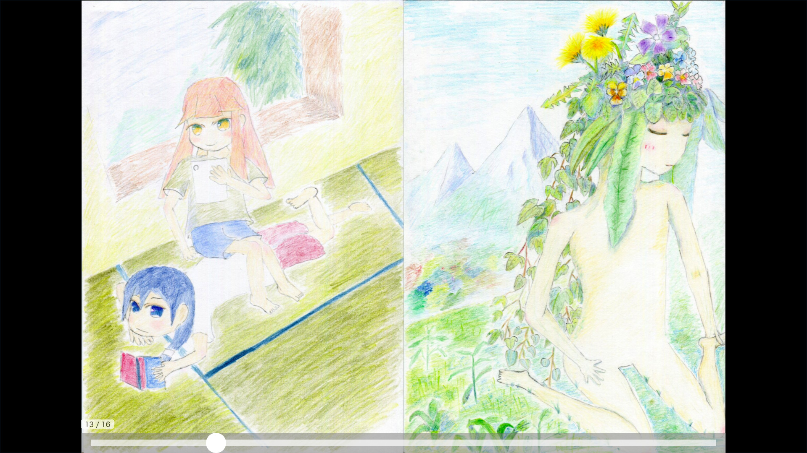

# Minobi(蓑火) - A HTML5 Manga Player

 Minobi is a HTML5 mange player.

# Sample

[](https://ledyba.github.io/Minobi/)

All artworks come from [妖精⊸ロケット(fairy⊸rocket)](https://hexe.net/), drawn by @ledyba and @momiji-san. Licensed under [CC-BY-SA 4.0](https://creativecommons.org/licenses/by-sa/4.0/deed).

# Requirement

## Supported browsers
 - iOS8 or later.
 - Latest Chrome.

## Dependencies
 Minobi does not depend on any external libraries or frameworks.

# How to use

## Load a manga

Please see [example](https://github.com/ledyba/Minobi/blob/master/web/index.html)

## Event handling

###Viewer

#### pageenter

This event will be fired when a user enter pages. The 'pages' argument is a list of page numbers, and it may consist of more than one page numbers, since Minobi displays more than one pages in the screen if applicable.

```js
var chapter = {/* page catalog in json */}/
Minobi.init(document.getElementById("minobi"), chapter, function(viewer) {
      //...

      /**
       * @param {[number]} pages
       */
      var handler = function(pages){
        // ...
      };
      viewer.addEventListener('pageenter', handler);
      viewer.removeEventListener('pageenter', handler);
    });
```

### Seekbar

#### activated/deactivated

This event will be fired when a seekbar is activated or deactivated.

```js
var seekbar = new Minobi.Seekbar(/* ... */);

seekbar.addEventListener('activated', function(){
  console.log("seekbar activated");
});
seekbar.addEventListener('deactivated', function(){
  console.log("seekbar deactivated");
});
```

## Customizing behaviour

### Viewer

#### transitionAreaRatio

```js
var viewer = new Minobi.Viewer(/*...*/);
/**
 * @type {number} transitionAreaRatioForTouch
 * [non-dimension] MUST BE IN [0, 0.5]
 * Tap actions will be treated as page transition actions
 * when the user released their finger in this range from left/right.
 */
viewer.transitionAreaRatioForTouch = 0.35;

/**
 * @type {number} transitionAreaRatioForTouch
 * [non-dimension] MUST BE IN [0, 0.5]
 * Click actions will be treated as page transition actions
 * when the user released their cursor in this range from left/right.
 */
viewer.transitionAreaRatioForMouse = 0.35;

```


### Seekbar

#### activationPeriod

A seekbar will automatically disappear after this period.

When set to 0, the seekbar won't automatically disappear at all.

```js
var seekbar = new Minobi.Seekbar(/* ... */);
seekbar.activePeriod = 1000;
```

# License

GPLv3 or later.

# What 'Minobi' means?

Minobi is a Japanese creature.
